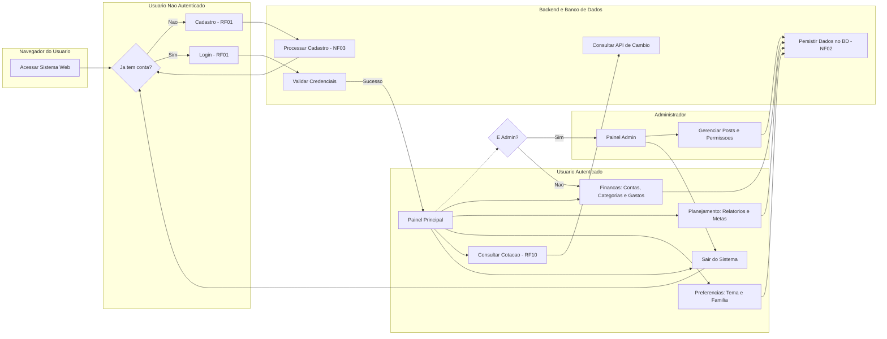

```mermaid
graph LR

    subgraph Cliente [Navegador do Usuario]
        Acesso[Acessar Sistema Web]
    end

    subgraph Unauth [Usuario Nao Autenticado]
        Login{Ja tem conta?}
        NovoCadastro[Cadastro - RF01]
        FazerLogin[Login - RF01]
    end

    subgraph AuthUser [Usuario Autenticado]
        Painel[Painel Principal]
        AcoesFin[Financas: Contas, Categorias e Gastos]
        AcoesPlan[Planejamento: Relatorios e Metas]
        AcoesExt[Preferencias: Tema e Familia]
        Cotacao[Consultar Cotacao - RF10]
        Logout[Sair do Sistema]
    end

    subgraph Admin [Administrador]
        PainelAdmin[Painel Admin]
        AcoesAdmin[Gerenciar Posts e Permissoes]
    end

    subgraph Sistema [Backend e Banco de Dados]
        SysCadastro[Processar Cadastro - NF03]
        SysLogin[Validar Credenciais]
        SysBD[Persistir Dados no BD - NF02]
        SysAPI[Consultar API de Cambio]
    end

    Acesso --> Login
    
    Login -- Nao --> NovoCadastro
    NovoCadastro --> SysCadastro
    SysCadastro --> Login
    
    Login -- Sim --> FazerLogin
    FazerLogin --> SysLogin
    SysLogin -- Sucesso --> Painel
    
    Painel -.-> DeterminaPapel{E Admin?}
    DeterminaPapel -- Sim --> PainelAdmin
    DeterminaPapel -- Nao --> AcoesFin
    
    Painel --> AcoesFin
    Painel --> AcoesPlan
    Painel --> AcoesExt
    Painel --> Cotacao

    AcoesFin --> SysBD
    AcoesPlan --> SysBD
    AcoesExt --> SysBD
    Cotacao --> SysAPI

    PainelAdmin --> AcoesAdmin
    AcoesAdmin --> SysBD

    Painel --> Logout
    PainelAdmin --> Logout
    Logout --> Login
```
